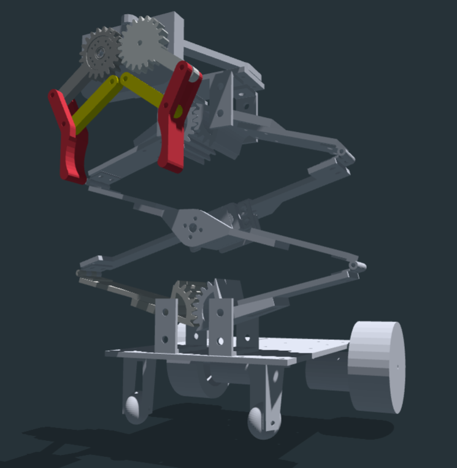
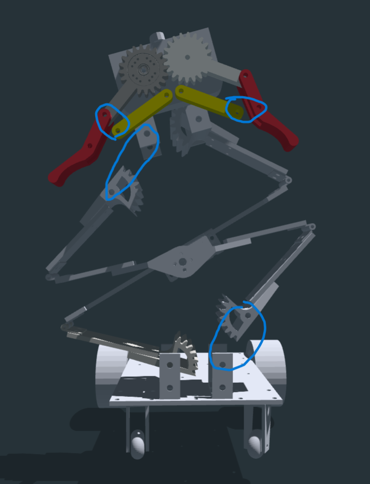

# Guideline For Online Teammates in **Team Khaki**
### Overview of the Mission Robot

Our Mission Robot is basically composed of three parts:

- a chassis with two rear drive wheels and two front caster wheels.

- a **scissor-lift mechanism** driven by a servo, and it's used for lifting and lowering the claw. (For a scissor-lift mechanism, refer to https://www.thingiverse.com/thing:5225652)
- a claw driven by another servo.

Due to the limitations of the URDF format, which requires a **tree-like structure**, I had to make some adjustments to represent the closed-loop kinematic chain of our linkage mechanism in Mission Robot.

### What I Did

I modeled the mechanism as an **open-chain** system by defining only **several revolute/continuous joints** in the URDF, **while other joints (in red circles in the screenshot below)**, which closes the loop, has been omitted.

### What You Need to Do

To make the mechanism work correctly in Gazebo, you'll need to handle the closed-loop constraint manually, i.e. to re-establish the **omitted concentric connections** and **the mesh relationship between gears** in the simulation. There are two primary ways to do this:

1. **Kinematic Calculations**: The simplest approach is to calculate the position of the "missing" link based on the geometry of the four-bar linkage. You can then use a ROS 2 node to publish the calculated joint state to control the fourth link.
2. **Gazebo Plugin**: For a more physically accurate simulation, you can create a Gazebo plugin. This plugin would apply a physical constraint to the two links that form the closed loop, ensuring they remain connected as they move.

Without one of these solutions, the mechanism will not function correctly in simulation, as the omitted joint will be completely unconstrained.

After the preparations above  for the robot model, you can start the simulation by controlling the spinning of the wheels and servos. The task for the Mission Robot to complete is clearly mentioned in the `Online Mode` part of **Rulebook**.

